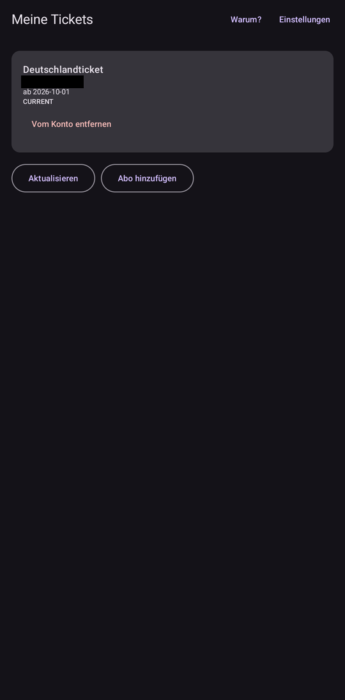
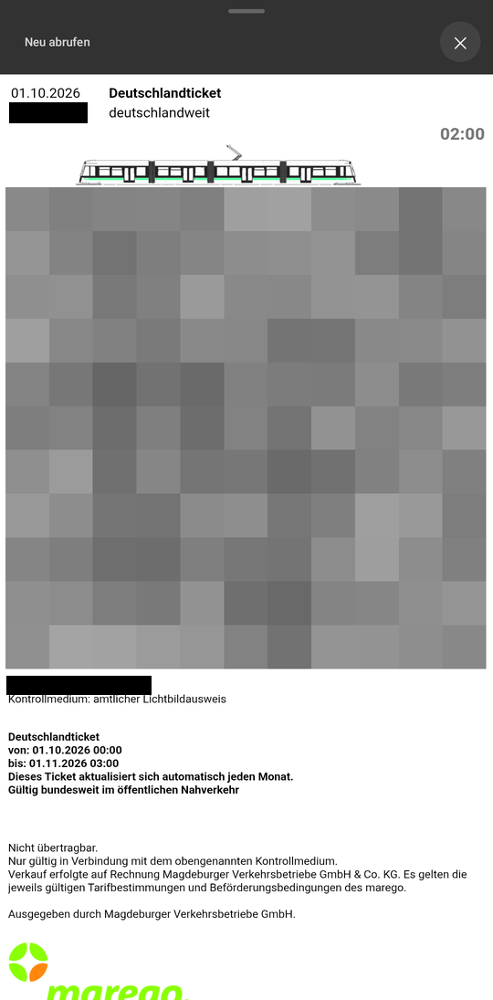
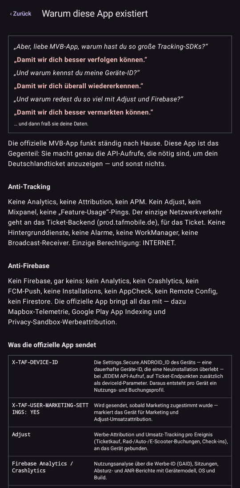
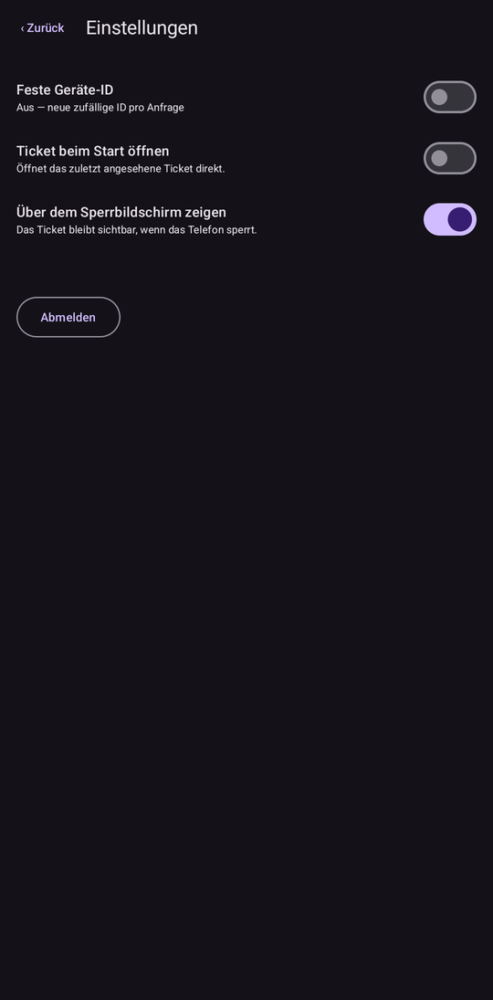

# D-Ticket Magdeburg

Dein Deutschlandticket der MVB (marego) auf dem Handy, ohne Tracking.

Die offizielle MVB-App schickt bei jeder Nutzung Daten an Firebase, Adjust,
Mapbox und andere. Diese App zeigt nur dein Ticket an und macht sonst nichts.

## Installieren

Die neueste APK gibt es unter
[Releases](https://github.com/cheetahdotcat/de.antitrack.deutschland-ticket-magdeburg/releases).
Herunterladen, öffnen, installieren.

## Benutzung

1. **Mit MVB-Konto anmelden** antippen und mit deinem MVB-Konto einloggen.
2. Das Deutschlandticket antippen. Es erscheint mit QR-Code so wie in der
   offiziellen App.

In den Einstellungen kannst du einstellen, dass das Ticket beim Start sofort
aufgeht oder auch auf dem Sperrbildschirm sichtbar bleibt.

Ein bestehendes marego-Abo lässt sich mit **Abo hinzufügen** zum Konto
hinzufügen.

## Datenschutz

Die App enthält keine Analyse- oder Werbebibliotheken und verbindet sich nur
mit dem Ticket-Server der MVB. Sie sendet keine dauerhafte Gerätekennung, und
die Anmeldedaten werden verschlüsselt auf dem Gerät gespeichert. Die einzige
benötigte Berechtigung ist der Internetzugriff.

Die App ist inoffiziell und steht in keiner Verbindung zur MVB oder zu marego.

## Screenshots

<p>
  
  
  
  
</p>

## Selbst bauen

Gebaut wird in podman, du brauchst also kein Android SDK. Leg zuerst eine
`secrets.properties` mit `MVB_CLIENT_ID` und `MVB_CLIENT_SECRET` an, dann:

```sh
./build.sh
```

## Lizenz

GPL-3.0-or-later
